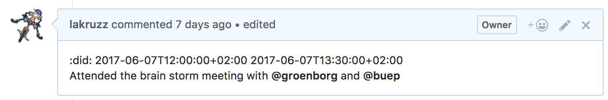

Google define the world _"dilly-dally"_ as _"waste time through aimless wandering or indecision."_. But the top definition on [the Urban Dictionary](http://www.urbandictionary.com/define.php?term=dilly%20dally){: target="blank"} is even more to the point: _"To mess around or waste time. Typically used by the very elderly."_ and with the following example of use:

>_Ah you young whipper snapper. Stop dilly dallying and get off your ass!_

## Why Dilly dally is needed

Praqma is a people's company. We don't have anything in stock except smart people, and we don't have anything to sell except their expertise - not always, but mostly - as billable hours to our clients.

Consequently, all people in Praqma will have to account for how they spent their work week, so that we actually remember to bill our customers.

This is no different from any other consulting bureau, but we actually believe that this discipline - to report the time spent - is not only relevant for consulting businesses, but it's a central part of an agile development team, that the time boxes (or story points) we set on our tasks also match the time we actually use.

READ:
* [Stopping development divination - replacing task estimates](http://www.praqma.com/stories/stopping-development-divination/){: target="blank"}
* [Milestones and office hours](http://www.praqma.com/stories/milestones-and-officehours/){: target="blank"}

As described in the two stories linked above, we work in GitHub and we use GitHub Issues and Milestones to run our sprints - So obviously we need:

__A utility that can enable us to log time directly on GitHub Issues - and report accordingly__

We're striving to make a utility that is useful for _any_ agile team using GitHub and GitHub Issues - regardless if you are billing the to customers or not.

It's not the consulting business that is in focus, but the agile project - and since we're all software developers we're doing it the only way we know how - _as code_ and with a dedicated focus to make it easy for the end-users (us!) to use the tool.

This is dilly-dally!

## An Emerging Tool

This utility is still in it's making. We're encouraging anyone who has interest in the project to reach out to us and join.

## User Stories

### Stay in terminal

>As a software developer
>
>I would like to log time spent on a GitHub issue - using only my terminal
>
>So that I can stay in my development environment, even when doing the reporting

### Prevent double logging
>As a software developer
>
>I would like to my time tracking system to prevent or warn me, when I try to log time (span) on an issue, that is already logged elsewhere
>
>So that I don't accidentally log the an overlapping time span twice

### Spot the holes
>As a software developer
>
>I would like to have access - from my terminal - to a report, that can show me how I logged my time, in a certain period
>
>So that I can easily see, what time spans - during a period - I still need to account for.

### Make corrections
>As a software developer
>
>I want to have easy (terminal) access to correct existing time log entries
>
>So that any mistakes I made, can be corrected as easy as creating new entries

### Project management
>As a project manager
>
>I want to have access to report over the total amount of time spent on a specific milestone
>
>So that I can continuously monitor that our time boxes are not overrun

## Design

Here's a quick walk-through of the design and technology that we're planning to use.

### Object model

To report effectively on all the time logging we need it to be ordered in _cost centers_ (who will pay the bill?) and _deliveries_ We bill when we have delivered value.

So consequently:

A _GitHub project_ has one _cost center_.

A _GitHub Issues Milestone_ correspond to _one delivery_.

A _cost center_ will default to the organization that host the repo - to override and assign a different cost center, add it to the the [front matter](https://jekyllrb.com/docs/frontmatter/){: target="blank"} of the `README.md` file in the repo

    ---
    cost-center: Company XYZ
    ---

Time is logged in _spans_ like _"from 10:00am to 11:00am I worked on issue praqma/dilly-dally#1"_

To get rid of the confusion of spans crossing midnight, and wether this was don in one time zone or another we will use ISO 8601 time format on all loggings so the logging above goes like this:

    2017-06-14T10:00:00+02:00 2017-06-14T11:00:00+02:00

It can seem a little verbose, but it _is_ human readable and at the same time leaves no room for ambiguity.

The time will be logged on the issue `praqma/dilly-dally#1` itself and as _the user_ who actually spend the time.

The time will be logged as an ordinary comment, prefixed with the _keyword_ `:did:` and on a single line.

Nothing else is required, but anything else typed in the same comment is to be regarded, as a _description_ to that particular logging.

Example:

{: target="blank"}

### Interface

The primary interface will be a command line tool which we've decided to call `did`.

The first simple use is simply to add the comments to the issues as showed above.

An example:

    did 10:00 11:00 on praqma/dilly-dally#7

On the comment the time span will be converet to the ISO 8601 format and logged on the issue - the comment actor will be _me_.

But `did` will be clever enough to deduct the context I'm in, so if I already CD'ed into a git repo, that represents `praqma/dilly-dally` and I'm already working in a context, that represents issue #7 (this is described in quite some detail in ["the phlow"](https://github.com/Praqma/git-phlow){: target="blank"}) then I can just deliver the time span:

    did 10 11

If I then tried to log 10:30 to 12:00 on another issue, I should be warned, since the period 10:00-10:30 would then be logged twice.

Accordingly I would need easy access to a report, that shows any holes in my logging. Default span for this report should be _the current week_. Something like:

    did report lakruzz

A first version of this report, could be either a printout to console, but probably even more useful, a `report.html` that I could open locally in a browser, and it could contain a graphical representations and links to issues - it could even have some JavaScript support, so that I could "fill in the holes" or "correct the mistakes" which would then generate the corresponding `did` commands.

## Feed back

...and comments is very welcome - use the issue tracking system:
